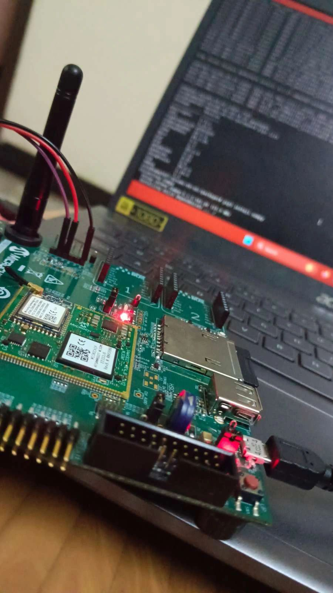
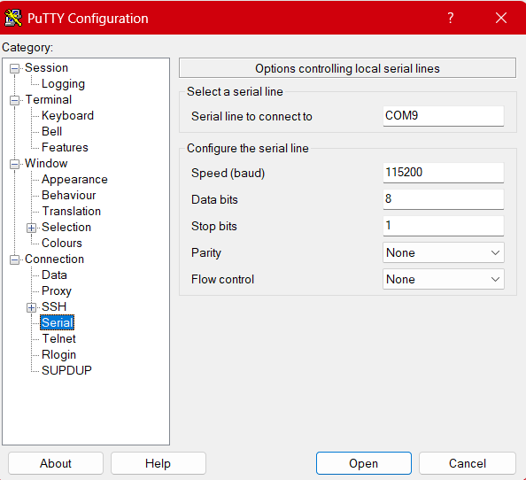

# AI-Face-Detection-using-ATSAMA5D27-WLSOM-EK1

## STEPS
1. Install OS Image
2. Flash the image to SD Card through Balena Etcher
3. Connect the board with laptop using usb to ttl connector
4. Open Putty for communication with board
5. Boot the board with OS

## INSTALLATION OF OS
There are two methods of OS installation:
1. Downloading OS image through website
2. Building OS from scratch

## NOTE: I Would recommend you to use Buildroot OS.

### 1. Downloading OS through website
[LINUX4SAM WEBSITE](https://www.linux4sam.org/bin/view/Linux4SAM/Sama5d27WLSom1EKMainPage)

- Visit the website and scroll down there you will see an option to download OS Image. We have two OS namely Buildroot OS and Yoctoproject OS. We have two varients in each OS which is headless and graphics. If you want to connect with Display and get video output, remember to download Graphics version for use.
- After downloading the OS extract it

 ### 2. Downloading OS from scratch
 [BuildRoot OS](https://www.linux4sam.org/bin/view/Linux4SAM/BuildRoot)

 - visit the website
 - There you have a set of unix commands to install buildroot os
 - Use Ubuntu and execute each commands to build your OS
 - You can even customise the OS by executing makemenuconfig and enable or disable certain functionalities

## FLASH IMAGE TO SD CARD
- After following the above steps you will be ready with SD image
- Now install [Balena etcher](https://etcher.balena.io/)
- Open Balena etcher and flash the image into your SD card

## CONNECT BOARD TO LAPTOP
- Now you have your sd card with OS. It's time to flash the board
- Insert SD card in board
- You need USB to TTL connector to connect board with laptop
- Connect it

## Putty FOR COMMUNICATION
- After making connections open putty for serial communication
- Enter the COM port and other infos
- Click open
- You will see a black screen
- Now press start button in board to boot

## Space partitioning for yocto
After setting up Putty, we encountered issues while attempting to install the essential packages in both Yocto & Builtroot environment. The major issues that we enountered
was, "No space left" so we were unable to install any packages due to inefficient storage.  We were using an 8GB SD card and 90% of it was unallocated. Despite, this the
error persisted. Later, we came to know about the partition spacing. In default partition only 500Mb was allotted, so the OS that was installed took all the space and left
the partition with only 63Mb.So then we were supposed to partition the unallocated space and mount it in the OS. 
The steps to be followed to partition the space is as followed: 

<ol>
<li> Open your Ubuntu</li>
<li> Search for "Disk Utility"</li>
<li> Select the SD card</li>
<li> Click on the root partition</li>
<li> Click settings icon and select resize</li>
<li> Enter the required space and click OK</li>
</ol>

Now the unallocated space will be allocated in root partition. This is the case with Yocto Project.to partition the space in Buildroot, you will encounter an error. It is
restricted to extend the root's space in buildroot. So as an alternative you have to create a new
partition and mount it separately. The steps to be folllowed are:

<ol>
<li>Open Ubuntu
<li>open Disk Utility 
<li>click on the sd card
<li>select the new partition
<li>Resize with the required disk space and press ok
</ol>

Be specific with the ubuntu version you use. Because only ubuntu's 18th or 21st version will be supportive (lts version of ubuntu).
A lot of issues were faced to install few packages. 
The only way to do the installation is by Cross-Compilation, where the installation and dependencies are done in Ubuntu and the same files are transferred to the sd card and
it is booted on the board again. Now we will have all the files needed in the OS, and it an be used in the board.

 

